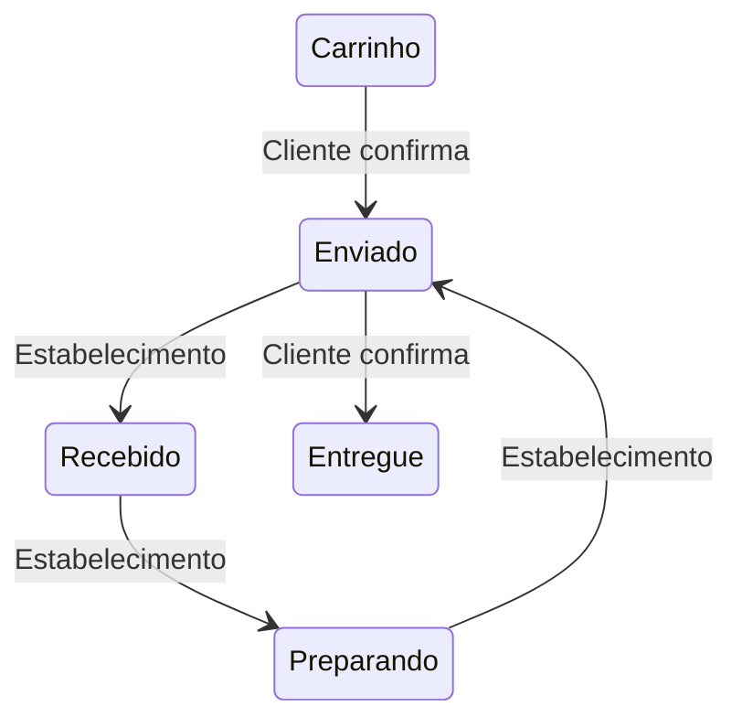

# 📚 Referência da API - Rangos

## **Autenticação**

### **Cadastro de Usuário**
```http
POST /signup
```

**Body (multipart/form-data):**
```json
{
  "name": "João Silva",
  "email": "joao@email.com",
  "password": "senha123",
  "phone": "11999999999",
  "typeUser": "Customer",
  "avatar": "arquivo.jpg" (opcional)
}
```

**Respostas:**
- 201 Created: Usuário criado com token JWT
- 409 Conflict: Email/telefone já cadastrado

### **Login**
```http
POST /login
```

**Body:**
```json
{
  "email": "joao@email.com",
  "password": "senha123"
}
```

**Resposta:**
```json
{
  "token": "eyJhbGci...",
  "user": {
    "id": "123",
    "name": "João Silva"
  }
}
```

---

## **Usuários**

### **Obter Perfil**
```http
GET /user/:id
Headers: Authorization: Bearer <token>
```

### **Atualizar Usuário**
```http
PUT /user/:id
Headers: Authorization: Bearer <token>
Body (multipart/form-data): { ... }
```

### **Excluir Usuário**
```http
DELETE /user/:id
Headers: Authorization: Bearer <token>
```

### **Endereços do Usuário**
```http
GET    /user/:id/address
POST   /user/:id/address
PUT    /user/:id/address/:addressId
DELETE /user/:id/address/:addressId
```

**Exemplo de Endereço:**
```json
{
  "street": "Rua das Flores",
  "number": "123",
  "city": "São Paulo",
  "state": "SP"
}
```

---

## **Estabelecimentos**

### **Listar Estabelecimentos**
```http
GET /establishments
```

**Parâmetros Query:**
- `category`: Filtrar por categoria
- `name`: Busca por nome

### **Criar Estabelecimento**
```http
POST /establishments
Headers: Authorization: Bearer <token>
Body (multipart/form-data): {
  "name": "Pizzaria XYZ",
  "coverPhoto": "arquivo.jpg",
  ...
}
```

### **Detalhes do Estabelecimento**
```http
GET /establishments/:id
```

### **Produtos do Estabelecimento**
```http
GET /establishments/:id/products
```

---

## **Produtos**

### **Criar Produto**
```http
POST /products
Headers: Authorization: Bearer <token>
Body (multipart/form-data): {
  "name": "Pizza Calabresa",
  "price": 45.90,
  "coverPhoto": "arquivo.jpg"
}
```

### **Buscar Produtos**
```http
GET /products/search?name=calabresa
```

### **Atualizar Produto**
```http
PUT /products/:id
Headers: Authorization: Bearer <token>
```

---

## **Pedidos**

### **Fluxo de Pedidos**


### **Criar Pedido**
```http
POST /user/:userId/orders
Headers: Authorization: Bearer <token>
Body: {
  "products": [
    {"productId": "456", "quantity": 2}
  ]
}
```

### **Gerenciar Itens do Pedido**
```http
PUT    /user/:userId/orders/:orderId/products
DELETE /user/:userId/orders/:orderId/products/:productId
```

### **Atualizar Status**
```http
PUT /establishments/:id/orders/:orderId
Body: {"status": "Preparando"}
```

---

## **Uploads**

### **Enviar Arquivo**
```http
POST /uploads/establishments
Content-Type: multipart/form-data
Body: { file: "imagem.jpg" }
```

**Tipos Permitidos:**
| Rota           | Formatos         | Tamanho Máx |
|----------------|------------------|-------------|
| /uploads/users | PNG, JPEG, JPG   | 2MB         |
| /uploads/*     | PNG, JPEG, JPG   | 8MB         |

---

## **Códigos de Erro Comuns**

| Código | Mensagem                        | Descrição                  |
|--------|---------------------------------|----------------------------|
| 400    | Dados de entrada inválidos      | Validação falhou           |
| 401    | Token inválido ou ausente       | Não autenticado            |
| 403    | Acesso não autorizado           | Permissões insuficientes   |
| 404    | [Recurso] não encontrado        | ID inexistente             |
| 413    | Arquivo excede tamanho máximo   | Limite de upload excedido  |

**[Lista Completa de Erros →](ERRORS.md)**

---

## **Exemplo de Uso Completo**

### **1. Login**
```bash
curl -X POST http://localhost:3000/login \
  -H "Content-Type: application/json" \
  -d '{"email": "joao@email.com", "password": "senha123"}'
```

### **2. Criar Pedido**
```bash
curl -X POST http://localhost:3000/user/123/orders \
  -H "Authorization: Bearer eyJhbGci..." \
  -H "Content-Type: application/json" \
  -d '{"products": [{"productId": "abc123", "quantity": 2}]}'
```

### **3. Acompanhar Pedido**
```bash
curl -X GET http://localhost:3000/user/123/orders \
  -H "Authorization: Bearer eyJhbGci..."
```

---

**Notas de Segurança:**
- Todas as rotas (exceto `/signup` e `/login`) requerem token JWT
- Tokens devem ser enviados no header: `Authorization: Bearer <token>`
- Senhas são armazenadas com hash bcrypt

**[Guia Completo de Autenticação →](AUTH_GUIDE.md)**

```markdown
[//]: # (Mantenha esta documentação atualizada com as mudanças na API)
```

Este arquivo deve ser salvo como `API_REFERENCE.md` no seu repositório. Cada seção pode ser expandida com mais exemplos conforme necessário.
