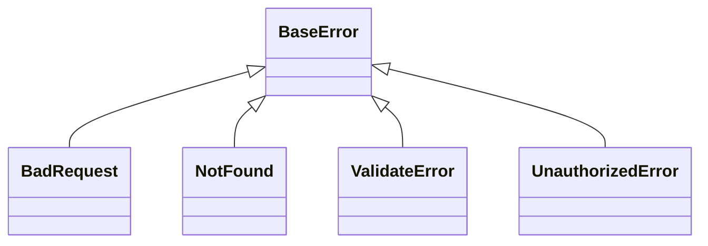
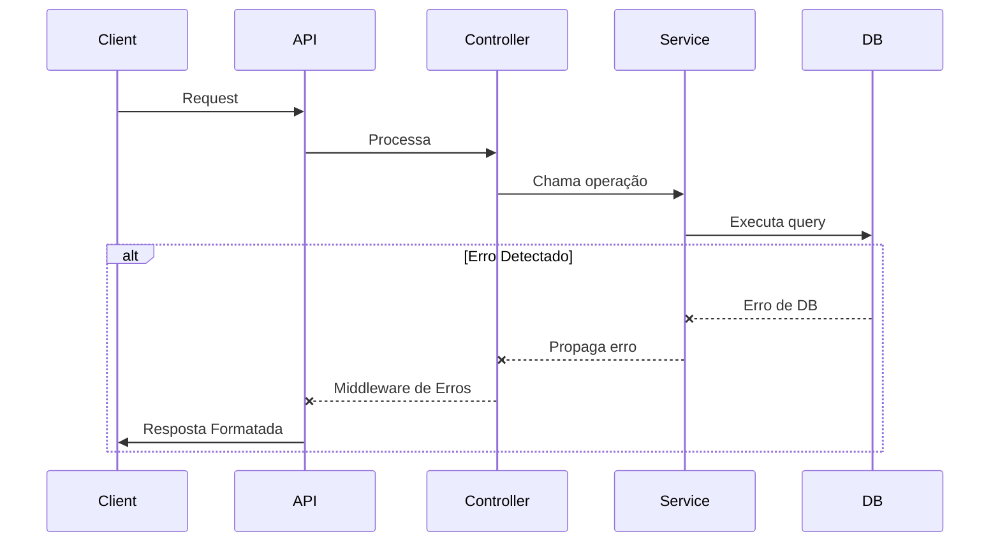

# 🚨 Tratamento de Erros - Rangos

## **Códigos de Status HTTP**

| Código | Nome                  | Descrição                              |
|--------|-----------------------|----------------------------------------|
| 400    | Bad Request           | Requisição mal formatada ou inválida   |
| 401    | Unauthorized          | Autenticação necessária                |
| 403    | Forbidden             | Acesso ao recurso não permitido        |
| 404    | Not Found             | Recurso não encontrado                 |
| 409    | Conflict              | Conflito de dados (ex: email duplicado)|
| 413    | Payload Too Large     | Arquivo excede tamanho máximo          |
| 422    | Unprocessable Entity  | Validação de dados falhou              |
| 500    | Internal Server Error | Erro genérico do servidor              |

---

## **Erros Personalizados**

### **Hierarquia de Erros**


### **Classes Principais**
```typescript
// Classe base para todos os erros
class BaseError extends Error {
  status: number;

  constructor(message: string, status = 500) {
    super(message);
    this.status = status;
  }

  sendResponse(res: Response) {
    res.status(this.status).json({
      status: this.status,
      message: this.message
    });
  }
}

// Exemplo de erro específico
class NotFound extends BaseError {
  constructor(message = 'Recurso não encontrado') {
    super(message, 404);
  }
}
```

---

## **Lista Completa de Erros**

### **400 - Bad Request**
**Causas Comuns:**
- Campos obrigatórios faltando
- Formato de JSON inválido
- Tipos de dados incorretos

**Exemplo de Resposta:**
```json
{
  "status": 400,
  "message": "Formato de email inválido"
}
```

### **401 - Unauthorized**
**Cenários:**
- Token JWT ausente
- Token expirado
- Assinatura inválida

**Exemplo de Resposta:**
```json
{
  "status": 401,
  "message": "Token de acesso inválido"
}
```

### **404 - Not Found**
**Casos de Uso:**
- ID de recurso inexistente
- Rota não mapeada

**Exemplo de Resposta:**
```json
{
  "status": 404,
  "message": "Usuário 507f1f77bcf86cd799439011 não encontrado"
}
```

### **422 - Validação Falhou**
**Estrutura Detalhada:**
```json
{
  "status": 422,
  "message": "Erros de validação encontrados",
  "errors": [
    "Senha deve ter pelo menos 8 caracteres",
    "Telefone em formato inválido"
  ]
}
```

### **500 - Erro Interno**
**Registro no Log:**
```log
[ERROR] 2024-03-15T14:30:45.789Z - Database connection failed
    at connectDB (src/config/db.ts:15:11)
    at processTicksAndRejections (node:internal/process/task_queues:96:5)
```

---

## **Fluxo de Tratamento**


---

## **Boas Práticas**

1. **Use Erros Específicos**
```typescript
throw new BadRequest('Formato de data inválido (Use YYYY-MM-DD)');
```

2. **Registre Erros Criticos**
```typescript
logger.error(`Falha no checkout: ${error.message}`, {
  userId: req.user.id,
  errorStack: error.stack
});
```

3. **Validação Proativa**
```typescript
if (!mongoose.Types.ObjectId.isValid(id)) {
  throw new BadRequest('ID em formato inválido');
}
```

---

## **Exemplo de Implementação**

### **Middleware de Erros**
```typescript
function errorHandler(err: Error, req: Request, res: Response, next: NextFunction) {
  if (err instanceof BaseError) {
    return err.sendResponse(res);
  }

  if (err instanceof mongoose.Error.ValidationError) {
    return new ValidateError(err).sendResponse(res);
  }

  new BaseError('Erro interno do servidor').sendResponse(res);
}
```

### **Uso no Controller**
```typescript
async getProduct(req: Request, res: Response) {
  try {
    const product = await Product.findById(req.params.id);
    if (!product) throw new NotFound('Produto não encontrado');
    res.json(product);
  } catch (error) {
    next(error);
  }
}
```

---

## **Erros do Banco de Dados**

| Erro do MongoDB | Mapeamento HTTP | Ação Recomendada              |
|-----------------|-----------------|--------------------------------|
| CastError       | 400             | Verificar formatos de ID/data |
| ValidationError | 422             | Corrigir dados de entrada     |
| DuplicateKey    | 409             | Checar valores únicos         |
| NetworkError    | 503             | Testar conexão com DB         |

---

## **Guia para Clientes**

### **Tratando Erros no Frontend**
```javascript
try {
  const response = await api.get('/user/me');
} catch (error) {
  if (error.response?.status === 401) {
    redirectToLogin();
  } else {
    showToast(error.response?.data?.message || 'Erro desconhecido');
  }
}
```

### **Estrutura de Resposta Padrão**
```json
{
  "status": 400,
  "message": "Mensagem amigável",
  "details": "Detalhes técnicos (opcional)",
  "code": "VALIDATION_ERROR (opcional)"
}
```

---

## **Melhorias Futuras**

1. **Tipos de Erros Adicionais:**
```typescript
class RateLimitError extends BaseError {
  constructor() {
    super('Muitas requisições', 429);
  }
}
```

2. **Documentação Machine-Readable:**
```json
{
  "error_codes": [
    {
      "code": "INVALID_TOKEN",
      "http_status": 401,
      "description": "Token JWT inválido ou expirado"
    }
  ]
}
```

---

**Nota:** Mantenha esta lista sincronizada com os middlewares de erro e classes em `src/errors/`.
**Última Revisão:** 15/03/2024

```markdown
[//]: # (Atualizar sempre que novos erros forem implementados)
```

Este arquivo deve ser salvo como `ERRORS.md`. Para cada novo erro implementado, atualize a documentação correspondente.
