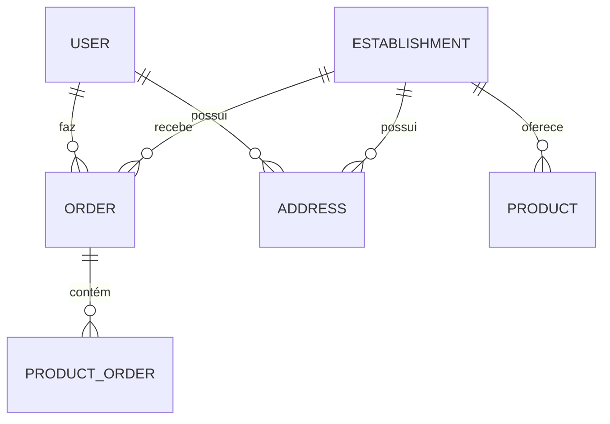

# 📦 Modelos de Dados - Rangos

## **Diagrama de Entidades**


---

## **1. Usuário (User)**
### **Schema**
```typescript
interface IUser {
  id: mongoose.Types.ObjectId;
  avatar: string;
  name: string;
  email: string;
  phone: string;
  password: string;
  address: IAddress[];
  typeUser: TypeUser;
}
```

### **Campos**
| Campo      | Tipo               | Obrigatório | Validação                  | Descrição                     |
|------------|--------------------|-------------|----------------------------|-------------------------------|
| avatar     | String             | Não         | -                          | Nome do arquivo de avatar     |
| name       | String             | Sim         | -                          | Nome completo                |
| email      | String             | Sim         | Único, formato email       | Email de acesso              |
| phone      | String             | Sim         | Único                      | Telefone com DDD             |
| password   | String             | Sim         | Min 8 caracteres           | Senha hasheada               |
| typeUser   | Enum TypeUser      | Sim         | Customer/Establishment     | Tipo de conta                |
| address    | [Address]          | Não         | -                          | Lista de endereços           |

### **Exemplo JSON**
```json
{
  "id": "507f1f77bcf86cd799439011",
  "name": "João Silva",
  "email": "joao@email.com",
  "phone": "11999999999",
  "typeUser": "Customer",
  "address": [{
    "street": "Rua das Flores",
    "number": "123",
    "city": "São Paulo",
    "state": "SP"
  }]
}
```

---

## **2. Estabelecimento (Establishment)**
### **Schema**
```typescript
interface IEstablishment {
  id: mongoose.Types.ObjectId;
  coverPhoto?: string;
  name: string;
  openingHours: OpeningHour[];
  deliveryTime: string;
  shipping: number;
  address: IAddress[];
  category: Category;
}
```

### **Campos Especiais**
**openingHours:**
```typescript
interface OpeningHour {
  openDays: OpenDay[];
  hours: Hour[];
}

interface Hour {
  open: string;  // Formato HH:MM ou "closed"
  close: string; // Formato HH:MM ou "closed"
}
```

### **Enums**
**OpenDay:**
```typescript
enum OpenDay {
  Segunda = "Monday",
  Terça = "Tuesday",
  // ... outros dias
}
```

**Category:**
```typescript
enum Category {
  Restaurante = "Restaurant",
  Lanchonete = "Coffee Shop",
  // ... outras categorias
}
```

### **Exemplo JSON**
```json
{
  "name": "Pizzaria Bella",
  "category": "Restaurant",
  "deliveryTime": "30-45 minutos",
  "openingHours": [{
    "openDays": ["Monday", "Tuesday"],
    "hours": [{ "open": "10:00", "close": "22:00" }]
  }]
}
```

---

## **3. Produto (Product)**
### **Schema**
```typescript
interface IProduct {
  id: mongoose.Types.ObjectId;
  coverPhoto?: string;
  name: string;
  description: string;
  price: number;
  establishment: mongoose.Types.ObjectId;
}
```

### **Validações**
- `price`: Número positivo
- `establishment`: Referência válida a Establishment

### **Exemplo JSON**
```json
{
  "name": "Pizza Calabresa",
  "price": 49.90,
  "description": "Molho, queijo, calabresa...",
  "establishment": "507f1f77bcf86cd799439012"
}
```

---

## **4. Pedido (Order)**
### **Schema**
```typescript
interface IOrder {
  id: mongoose.Types.ObjectId;
  userId: mongoose.Types.ObjectId;
  establishmentId: mongoose.Types.ObjectId;
  status: OrderStatus;
  products: IProductOrder[];
  totalPrice: number;
}
```

### **Status do Pedido**
```typescript
enum OrderStatus {
  Carrinho = "Cart",
  Enviado = "Ordered",
  Recebido = "Received",
  Preparando = "Preparing",
  Entregue = "Delivered"
}
```

### **Estrutura de Produto no Pedido**
```typescript
interface IProductOrder {
  quantity: number;
  productId: mongoose.Types.ObjectId;
}
```

### **Exemplo JSON**
```json
{
  "status": "Preparing",
  "products": [{
    "productId": "507f1f77bcf86cd799439013",
    "quantity": 2
  }],
  "totalPrice": 99.80
}
```

---

## **5. Endereço (Address)**
### **Schema**
```typescript
interface IAddress {
  description?: string;
  street: string;
  number: string;
  complement?: string;
  neighborhood: string;
  city: string;
  state: string;
}
```

### **Campos Obrigatórios**
- street
- number
- neighborhood
- city
- state (2 caracteres)

---

## **6. Relacionamentos**
| Modelo          | Relação           | Descrição                          |
|-----------------|-------------------|------------------------------------|
| User            | hasMany Order     | Um usuário faz vários pedidos      |
| Establishment   | hasMany Product   | Estab. oferece vários produtos     |
| Order           | belongsTo User    | Pedido pertence a um usuário       |
| ProductOrder    | belongsTo Product | Item referencia um produto         |

---

## **7. Índices e Otimizações**
| Modelo       | Campo        | Tipo     | Descrição               |
|--------------|--------------|----------|-------------------------|
| User         | email        | Único    | Busca rápida por email  |
| User         | phone        | Único    | Garante telefone único  |
| Product      | name         | Texto    | Busca full-text         |
| Establishment| category     | Índice   | Filtragem por categoria |

---

## **8. Boas Práticas**
1. **População de Dados:**
```typescript
Order.findById(id)
  .populate('products.productId', 'name price')
  .populate('establishmentId', 'name')
```

2. **Validação de Referências:**
```typescript
const isValidEstablishment = await Establishment.exists(order.establishmentId);
```

3. **Projeção de Segurança:**
```typescript
User.findById(id).select('-password -__v');
```

4. **Manipulação de Arquivos:**
```typescript
// Excluir arquivo antigo ao atualizar
if (user.avatar) fs.unlinkSync(path.join(uploadDir, user.avatar));
```

---

## **9. Migrações**
Exemplo de alteração de schema:
```javascript
db.products.updateMany(
  {},
  { $set: { isActive: true } }
)
```

---

## **10. Exemplo Completo de Relacionamento**
```javascript
// Criar pedido vinculado
const order = new Order({
  userId: user._id,
  establishmentId: establishment._id,
  products: [{
    productId: product._id,
    quantity: 2
  }]
});
```

---

**Nota:** Esta documentação deve ser atualizada sempre que houver mudanças nos modelos.
**Última atualização:** 15/03/2024

```markdown
[//]: # (Manter sincronizado com os schemas em src/models/)
```

Este arquivo deve ser salvo como `MODELS.md`. Para cada modificação nos modelos, atualize a documentação correspondente.
